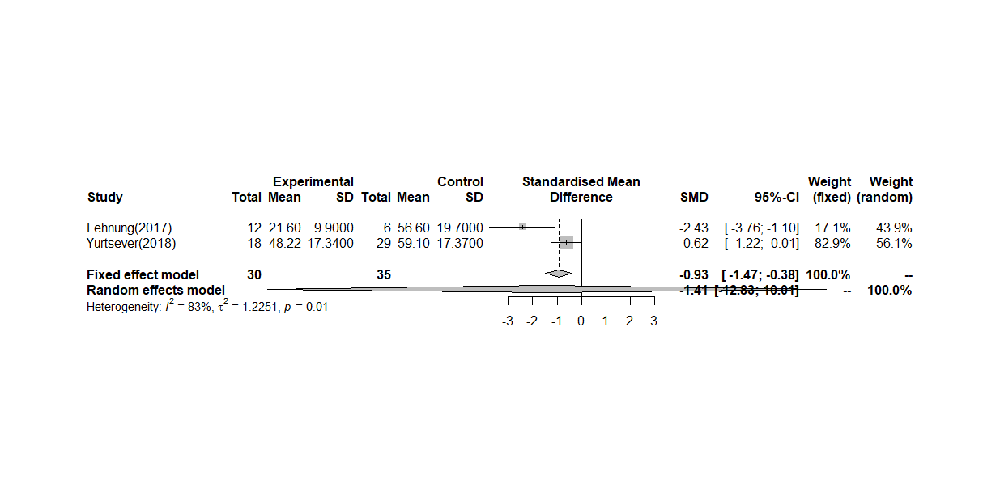

Meta análisis EMDR
================

## Agregación de estudios

Metaanálisis calculado con un modelo de efectos aleatorios usando el
estimador tau2 Hartung-Knapp-Sidik-Jonkman (HKSJ). Se emplea la funcón
*metacont* de las librería *metafor* y *meta* de R.

### Librerías y versiones R

``` r
library(meta)
```

    ## Loading 'meta' package (version 4.11-0).
    ## Type 'help(meta)' for a brief overview.

``` r
library(metafor)
```

    ## Loading required package: Matrix

    ## Loading 'metafor' package (version 2.4-0). For an overview 
    ## and introduction to the package please type: help(metafor).

    ## 
    ## Attaching package: 'metafor'

    ## The following objects are masked from 'package:meta':
    ## 
    ##     baujat, forest, funnel, funnel.default, labbe, radial, trimfill

### Resultados

``` r
m.hksj.raw <- metacont(Ne,
                       Me,
                       Se,
                       Nc,
                       Mc,
                       Sc,
                       data = Metaanalisis_EMDR,
                       studlab = paste(Author),
                       comb.fixed = TRUE,
                       comb.random = TRUE,
                       method.tau = "SJ",
                       hakn = TRUE,
                       prediction = TRUE,
                       sm = "SMD")
m.hksj.raw
```

    ##                     SMD             95%-CI %W(fixed) %W(random)
    ## Lehnung(2017)   -2.4268 [-3.7553; -1.0983]      17.1       43.9
    ## Yurtsever(2018) -0.6163 [-1.2186; -0.0139]      82.9       56.1
    ## 
    ## Number of studies combined: k = 2
    ## 
    ##                          SMD              95%-CI   z|t p-value
    ## Fixed effect model   -0.9250 [ -1.4736; -0.3764] -3.30  0.0010
    ## Random effects model -1.4116 [-12.8290; 10.0059] -1.57  0.3609
    ## 
    ## Quantifying heterogeneity:
    ##  tau^2 = 1.2251; tau = 1.1068; I^2 = 83.1% [29.5%; 95.9%]; H = 2.43 [1.19; 4.97]
    ## 
    ## Test of heterogeneity:
    ##     Q d.f. p-value
    ##  5.92    1  0.0150
    ## 
    ## Details on meta-analytical method:
    ## - Inverse variance method
    ## - Sidik-Jonkman estimator for tau^2
    ## - Hartung-Knapp adjustment for random effects model
    ## - Hedges' g (bias corrected standardised mean difference)

## Forest plot

``` r
forest(m.hksj.raw)
```

<!-- -->
